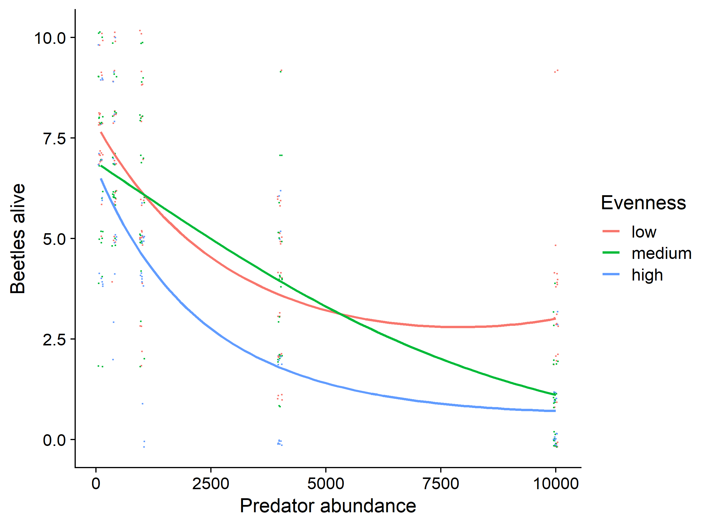

Dave’s figures
================
Riley M. Anderson
February 16, 2025

  

- [Overview](#overview)
- [Methods](#methods)
  - [Summary of Results](#summary-of-results)
- [Evenness as colors with dominant
  species](#evenness-as-colors-with-dominant-species)
- [Evenness as a facet](#evenness-as-a-facet)
- [Evenness in one figure, all lines are from richness =
  3](#evenness-in-one-figure-all-lines-are-from-richness--3)
- [Richness and evenness in one
  figure](#richness-and-evenness-in-one-figure)
  - [Session Information](#session-information)

## Overview

This is a first attempt at plotting Dave’s richness/evenness experiment.

All curves are generated by:

")

=\beta_{0}+\beta_{1}x_{i}+\beta_{2}x_{i}^{2}")

where

is the mean of alive beetles, and
 is the predator
abundance.

## Methods

1)  There were three possible natural enemy species (Bb, Hm, Sc)

2)  Treatments included either 1 species or all 3 species

3)  There were 3 single species treatments (each species by itself)

4)  There were 3 treatments with all three species. In these treatments,
    we varied the evenness from low to medium to high. In “low” evenness
    treatments the 3 species were distributed 90%, 5%, 5%. In “medium”
    evenness treatments the 3 species were distributed 60%, 20%, 20%. In
    “high evenness treatments the 3 species were distributed 33.3%,
    33.3%, 33.3%. We also made sure that each species was the dominant
    species in an equal number of replicates in “low” in “medium”
    treatments, so the experiment was fully factorial.

5)  We varied the abundance of individual species and the total
    community abundance from 100 to 400 to 1000 to 4000 to 10000

### Summary of Results

## Evenness as colors with dominant species

<!-- -->

## Evenness as a facet

<!-- -->

## Evenness in one figure, all lines are from richness = 3

<!-- -->

# Richness and evenness in one figure

<!-- -->

## Session Information

    R version 4.2.3 (2023-03-15 ucrt)
    Platform: x86_64-w64-mingw32/x64 (64-bit)
    Running under: Windows 10 x64 (build 19045)

    Matrix products: default

    locale:
    [1] LC_COLLATE=English_United States.utf8 
    [2] LC_CTYPE=English_United States.utf8   
    [3] LC_MONETARY=English_United States.utf8
    [4] LC_NUMERIC=C                          
    [5] LC_TIME=English_United States.utf8    

    attached base packages:
    [1] stats     graphics  grDevices utils     datasets  methods   base     

    other attached packages:
     [1] cowplot_1.1.3   lubridate_1.9.3 forcats_1.0.0   stringr_1.5.1  
     [5] dplyr_1.1.4     purrr_1.0.2     readr_2.1.5     tidyr_1.3.1    
     [9] tibble_3.2.1    ggplot2_3.5.1   tidyverse_2.0.0

    loaded via a namespace (and not attached):
     [1] highr_0.11        pillar_1.9.0      compiler_4.2.3    tools_4.2.3      
     [5] digest_0.6.35     lattice_0.20-45   nlme_3.1-162      timechange_0.3.0 
     [9] evaluate_0.24.0   lifecycle_1.0.4   gtable_0.3.5      mgcv_1.8-42      
    [13] pkgconfig_2.0.3   rlang_1.1.4       Matrix_1.5-3      cli_3.6.2        
    [17] rstudioapi_0.16.0 yaml_2.3.8        xfun_0.44         fastmap_1.2.0    
    [21] withr_3.0.0       knitr_1.47        generics_0.1.3    vctrs_0.6.5      
    [25] hms_1.1.3         rprojroot_2.0.4   grid_4.2.3        tidyselect_1.2.1 
    [29] glue_1.7.0        R6_2.5.1          fansi_1.0.6       rmarkdown_2.27   
    [33] farver_2.1.2      tzdb_0.4.0        magrittr_2.0.3    splines_4.2.3    
    [37] codetools_0.2-19  scales_1.3.0      htmltools_0.5.8.1 colorspace_2.1-0 
    [41] labeling_0.4.3    utf8_1.2.4        stringi_1.8.4     munsell_0.5.1    
